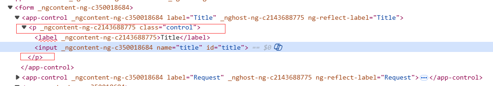
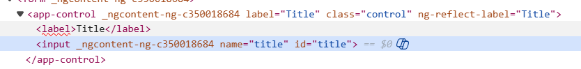
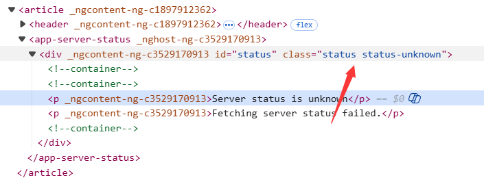

# Angular笔记

笔记来自于项目：

## 安装cli

```bash
# 设置为淘宝镜像
npm config set registry https://registry.npmmirror.com
# 验证当前镜像
npm config get registry

# 安装angular
npm install -g @angular/cli

# 创建一个app
ng new start-app

要不要google添加额外的配置 N
样式表设置 CSS
SSG 设置 N
Node ai辅助工具选择
```

## 配置文件

静态文件配置

```json
angular.json
{
  "$schema": "./node_modules/@angular/cli/lib/config/schema.json",
  "version": 1,
  "cli": {
    "packageManager": "npm"
  },
  "newProjectRoot": "projects",
  "projects": {
    "start-app": {
      "projectType": "application",
      "schematics": {},
      "root": "",
      "sourceRoot": "src",
      "prefix": "app",
      "architect": {
        "build": {
          "builder": "@angular/build:application",
          "options": {
            "browser": "src/main.ts",
            "tsConfig": "tsconfig.app.json",
            "assets": [
              "src/assets",  # 配置静态资产的目录比如图片
              {
                "glob": "**/*",
                "input": "public"
              }
            ],
            "styles": [
              "src/styles.css"
            ]
          },
          "configurations": {
            "production": {
              "budgets": [
                {
                  "type": "initial",
                  "maximumWarning": "500kB",
                  "maximumError": "1MB"
                },
                {
                  "type": "anyComponentStyle",
                  "maximumWarning": "4kB",
                  "maximumError": "8kB"
                }
              ],
              "outputHashing": "all"
            },
            "development": {
              "optimization": false,
              "extractLicenses": false,
              "sourceMap": true
            }
          },
          "defaultConfiguration": "production"
        },
        "serve": {
          "builder": "@angular/build:dev-server",
          "configurations": {
            "production": {
              "buildTarget": "start-app:build:production"
            },
            "development": {
              "buildTarget": "start-app:build:development"
            }
          },
          "defaultConfiguration": "development"
        },
        "test": {
          "builder": "@angular/build:unit-test"
        }
      }
    }
  }
}

```
修改`ng g c 组件名`的生成组件行为加上`component`的字符。
修改`angular.json`

```json
{
  "$schema": "./node_modules/@angular/cli/lib/config/schema.json",
  "version": 1,
  "newProjectRoot": "projects",
  "projects": {
    "investment-caculator": {
      "projectType": "application",
      "schematics": {
        "@schematics/angular:component": {
          "type": "component",
          "skipTests": true
        }
      }
```

### public目录

在public目录中的静态资源可以直接通过相对路径的方式使用文件名字进行访问。

```html

```


## 属性设置

ts中声明函数，和属性设置。

在标签中设置属性使用[]

```bash
# user.component.ts
export class UserComponent {
  selectUser = DUMMY_USERS[randomIndex];

  # 一个函数在调用的时候直接执行不需要()
  get imagePath() {
    return 'assets/users' + this.selectUser.avatar
  }
  
  onSelectUser() {
    console.log('Clicked on a user');
  }
}

# 在页面中调用直接使用
# user.component.html
<div>
  <button>
    
    <span>{{ selectUser.name }}</span>
  </button>
</div>
```

## 事件绑定

事件绑定使用()

```bash
# 就是在 user.component.ts 组件中声明的函数
<div>
  <button (click)="onSelectUser()">
    
    <span>{{ selectUser.name }}</span>
  </button>
</div>
```

2025/12/22 练习到08.

## 信号和信号计算

信号用于存储一个状态。computed用来计算新的值。

`signal`和`computed`

```bash
import { Component, computed, signal } from '@angular/core';

import { DUMMY_USERS } from '../dummy-users';

const randomIndex = Math.floor(Math.random() * DUMMY_USERS.length);

@Component({
  selector: 'app-user',
  standalone: true,
  templateUrl: './user.component.html',
  styleUrl: './user.component.css',
})
export class UserComponent {
  selectedUser = signal(DUMMY_USERS[randomIndex]);
  imagePath = computed(() => 'assets/users/' + this.selectedUser().avatar)

  // get imagePath() {
  //   return 'assets/users/' + this.selectedUser.avatar
  // }

  onSelectUser() {
    const randomIndex = Math.floor(Math.random() * DUMMY_USERS.length);
    this.selectedUser.set(DUMMY_USERS[randomIndex]);
  }
}
```

信号在模板中调用，信号的调用要使用（）

- user.component.html

```html

<div>
  <button (click)="onSelectUser()">
    
    <span>{{ selectedUser().name }}</span>
  </button>
</div>
```

### effect()方法

会在信号变化的时候执行函数。

```ts
import {
  Component,
  DestroyRef,
  OnDestroy,
  OnInit,
  effect,
  inject,
  signal,
} from '@angular/core';

@Component({
  selector: 'app-server-status',
  standalone: true,
  imports: [],
  templateUrl: './server-status.component.html',
  styleUrl: './server-status.component.css',
})
export class ServerStatusComponent implements OnInit {
  currentStatus = signal<'online' | 'offline' | 'unknown'>('offline');
  private destroyRef = inject(DestroyRef);

  constructor() {
    effect(() => {
      console.log(this.currentStatus());
    });
  }

  ngOnInit() {
    console.log('ON INIT');
    const interval = setInterval(() => {
      const rnd = Math.random(); // 0 - 0.99999999999999

      if (rnd < 0.5) {
        this.currentStatus.set('online');
      } else if (rnd < 0.9) {
        this.currentStatus.set('offline');
      } else {
        this.currentStatus.set('unknown');
      }
    }, 5000);

    this.destroyRef.onDestroy(() => {
      clearInterval(interval);
    });
  }

  ngAfterViewInit() {
    console.log('AFTER VIEW INIT');
  }

  // ngOnDestroy() {
  //   clearTimeout(this.interval);
  // }
}
effect()的作用
```

当 ngOnInit 里的定时器每 5 秒修改 currentStatus 的值时，effect 会被自动触发，控制台会打印出新的状态值

无需手动订阅 / 取消订阅，Angular 会自动管理 `effect` 的生命周期（结合 `DestroyRef` 自动清理）

## Inputs方法

组件之间传递参数，值。

一个组件要接受另外一个组件中的数据可以使用这种input的方式来传递值。

```bash
# app.component.ts
import { Component } from '@angular/core';
import { HeaderComponent } from './header/header.component'
import { UserComponent } from './user/user.component';
import {DUMMY_USERS} from './dummy-users';

@Component({
  selector: 'app-root',
  imports: [HeaderComponent, UserComponent],
  standalone: true,
  templateUrl: './app.component.html',
  styleUrl: './app.component.css',
})
export class AppComponent {
 // 父组件的值
  users = DUMMY_USERS;
}

# app.component.html
<app-header />
<main>
  <ul id="users">
    @for (user of users;track user.id){
      <li>
         # 这里定义了要传入的变量
        <app-user [avatar]="user.avatar" [name]="user.name" />
      </li>
    }
  </ul>
</main>

# user.component.ts 子组件
import { Component, Input } from '@angular/core';

@Component({
  selector: 'app-user',
  standalone: true,
  imports: [],
  templateUrl: './user.component.html',
  styleUrl: './user.component.css',
})

export class UserComponent {
  // 要接收的两个参数!是欺骗ts语法错误的
  @Input() avatar!: string;
  @Input() name!: string;
  
  // 如果参数是必填项就必须这样写
  // @Input({ required: true }) avatar!: string;
  // @Input({ required: true }) name!: string;

  get imagePath() {
    return "assets/users/" + this.avatar;
  }

  onSelectUser() {
  }
}

# 模板中使用user.component.html
# 这里的name就是从父组件中来的
<div>
  <button (click)="onSelectUser()">
    
    <span>{{ name }}</span>
  </button>
</div>

```

## input把输入作为信号处理

接收外部组件数据的另一种方式。

这是新版本的特性。

```bash
import { Component, computed, Input , input } from '@angular/core';

@Component({
  selector: 'app-user',
  standalone: true,
  imports: [],
  templateUrl: './user.component.html',
  styleUrl: './user.component.css',
})

export class UserComponent {
  // @Input({ required: true }) avatar!: string;
  // @Input({ required: true }) name!: string;

  avatar = input.required<string>();
  name = input.required<string>();

  imagePath = computed(() => {
    return "assets/users/" + this.avatar()
  })


  // get imagePath() {
  //   return "assets/users/" + this.avatar;
  // }

  onSelectUser() {

  }
}

# 模板引用 user.component.html
<div>
  <button (click)="onSelectUser()">
    
    <span>{{ name() }}</span>
  </button>
</div>

```

2025/12/23 练习到12-required-inputs

## Output输出属性

```ts
# user.component.ts
import { Component, computed, Input , input, Output, EventEmitter, output } from '@angular/core';

@Component({
  selector: 'app-user',
  standalone: true,
  imports: [],
  templateUrl: './user.component.html',
  styleUrl: './user.component.css',
})

export class UserComponent {
  @Input({required: true}) id!: string;
  @Input({ required: true }) avatar!: string;
  @Input({ required: true }) name!: string;
  @Output() select = new EventEmitter();
  
  // 这个是新版本中的方法写法更简洁
  //select = output<string>();

  // avatar = input.required<string>();
  // name = input.required<string>();

  // imagePath = computed(() => {
  //   return "assets/users/" + this.avatar()
  // })

  get imagePath() {
    return "assets/users/" + this.avatar;
  }

  onSelectUser() {
    this.select.emit(this.id)
  }
}

```

父组件的使用。

组件之间通信，有输入参数和输出参数，就像后端一样，创建组件用了多少参数，调用的时候就要与参数对应，输出组件的调用使用 (输出名)

onSelectUser($event) 是父组件触发的函数和接收的输入的参数。

$event 是一个user对象

```bash
# user.component.html
<app-user [avatar]="user.avatar" [name]="user.name" [id]="user.id" (select)="onSelectUser($event)" )/>

# user.component.ts
export class UserComponent {
  @Input({required: true}) user!: User;
  @Input({required: true}) selected!: boolean;  

  ......
  select = output<string>();

  onSelectUser() {
    // 这里把user 的id提交出去了
    this.select.emit(this.user.id);
  }
}


# app.component.ts
@Component({
  selector: 'app-root',
  imports: [HeaderComponent, UserComponent],
  standalone: true,
  templateUrl: './app.component.html',
  styleUrl: './app.component.css',
})
export class AppComponent {
  users = DUMMY_USERS;

  # 父组件接收来组子组件的输出所以是user 的id
  onSelectUser(id: string) {
    console.log("you select user" + id);
  }
}

```

## 参数使用

```ts
export class TasksComponent {
  // @Input({required: true}) name!: string;
  // 表示name是可选参数，可以是string也可以是未定义
  @Input() name?: string;
    
   // 直接声名
  // @Input() name: string | undefined;
}


// 三元表达式
<!-- selectedUser的值是否为空，空的就传“”，有值就传用户的名字 -->
  <app-tasks [name]="selectedUser ? selectedUser.name : ''" />
      
      
// 声名变量
selectedUserId?: string;
selectedUserId : string | undifined;
```

## 对象

对象的声名。

`interface`支持**单继承、多继承**，语法符合面向对象的直觉，可读性极强.

`type` 没有「继承」语法，想要扩展类型，只能用**交叉类型**把多个类型「合并」成新类型.

```bash
// 用户有很多的方法，可以通过interface或者type直接把用户定义为一个user对象
// type User = {
//   id: string,
//   avatar: string,
//   name: string
// }

interface User {
  id: string,
  avatar: string,
  name: string
}
```

## 数组

数组的方法

```ts
// filter方法会过滤出所有的，函数中是true的
get selectUserTasks() {
    return this.tasks.filter((task) => task.userId === this.userId);
  }
```

```ts
// find方法只会返回成功之后的第一个，里面传入一个函数
  get selectedUser() {
    return this.users.find((user) => user.id === this.selectedUserId);
  }
```

```ts
// 语法1：添加单个元素
数组.unshift(元素1);

// 语法2：添加多个元素（用逗号分隔）
数组.unshift(元素1, 元素2, 元素3, ...);
```

`unshift`方法会在数组开头的位置增加一个元素，并返回添加之后的数组长度。

## for循环

`users`是一个数组。

```html
<app-header />

<main>
  <ul id="users">
    @for (user of users; track user.id) {
      <li>
        <app-user [user]="user" (select)="onSelectUser($event)" />
      </li>
    }
  </ul>

  <app-tasks [name]="selectedUser ? selectedUser.name : ''" />
</main>
```

- $first 第一个，返回布尔值。
- $last 最后一个，返回布尔值。
- $count 更新for数组的长度。

```html
<div>
  <ul>
    @for (ticket of tickets; track ticket.id) {
      <li>
        <app-ticket [data]="ticket" /> - {{ $last }}
      </li>
    } @empty {
      <p>No tickets available.</p>
    }
  </ul>
</div>
```

@empty如果循环的数组是空则显示定义的内容

```html
<div>
  <ul>
    @for (ticket of tickets; track ticket.id) {
      <li>
        <app-ticket [data]="ticket" />
      </li>
    } @empty {
      <p>No tickets available.</p>
    }
  </ul>
</div>
```


## if判断

```html
  @if (selectedUser) {
    <!-- selectedUser的值是否为空，空的就传“”，有值就传用户的名字 -->
    <app-tasks [name]="selectedUser ? selectedUser.name : ''" />

  } @else {
    <p id="fallback">Select a user to see their tasks!</p>
  }
```

老版本的if判断和for

```ts
// 依赖这两个模块
import { NgFor, NgIf } from '@angular/common';
```

新版本的更简洁。

```html
<main>
  <ul id="users">
    <!-- @for (user of users; track user.id) { -->
      <li *ngFor="let user of users">
        <app-user [user]="user" (select)="onSelectUser($event)" />
      </li>
    <!-- } -->
  </ul>

  <!-- @if (selectedUser) { -->
    <app-tasks *ngIf="selectedUser; else fallback" [name]="selectedUser!.name" />
  <!-- } @else { -->
    <ng-template #fallback>
      <p id="fallback">Select a user to see their tasks!</p>
    </ng-template>
  <!-- } -->
</main>
```

## 语法记录

```ts
[class.active]="selected"  selected是一个布尔值，

//当 selected = true 时，元素会自动添加 active 类 → 元素最终会有 class="active"；
//当 selected = false 时，元素会自动移除 active 类 → 元素不会包含 active 类。
```

## 双向绑定

`FormsModule`在导入之后会自动接管<forms>标签，而且会阻止默认的浏览器提交行为。

```ts
// 依赖模块
import {FormsModule} from '@angular/forms';


// 模板中使用
[(ngModel)]="enteredDate"
```

## ng-content

比如这个组件有一个公共的样式，我们把这个去装饰其他的组件。需要在标签中加入<ng-content />才能正常的把装饰组件中的内容显示出来。

```bash
import { Component } from '@angular/core';

@Component({
  selector: 'app-card',
  imports: [],
  standalone: true,
  template: `<div>
              <ng-content />
            </div>`,
  styleUrl: './card.component.css',
})
export class CardComponent {

}

# 其他组件引用
// 把其他的组件装饰在中间
<app-card>
  <article>
    <h2>{{ task.title }}</h2>
    <time>{{ task.dueDate }}</time>
    <p>{{ task.summary }}</p>
    <p class="actions">
      <button (click)="onCompelateTask()">Complete</button>
    </p>
  </article>
</app-card>


// 包裹其他的组件
<app-card>
    <app-home />
</app-card>
```

## 组件扩展器


## 管道

参考地址：https://angular.cn/guide/templates/pipes#

管道的作用就是把输出的变量再进行处理，管道还可以添加额外的参数。

日期管道

```ts
import {DatePipe} from '@angular/common';

@Component({
  selector: 'app-task',
  imports: [CardComponent,DatePipe],
  standalone: true,
  templateUrl: './task.component.html',
  styleUrl: './task.component.css',
})

<time>{{ task.dueDate | date:'fullDate' }}</time>
```

## 服务

**服务（Service）** 是**单例的、注入式的类**，核心作用是**抽离公共业务逻辑、数据交互、工具方法**，实现组件与组件、组件与数据层的解耦，是 Angular 中实现**跨组件数据共享、统一业务管理**的核心方案。

一个服务无论被多少个组件 / 指令 / 其他服务注入，Angular 只会创建唯一的一个实例。

一个服务只做一件事。

```bash
import { Injectable } from '@angular/core';

# 全局可用
@Injectable({ providedIn: 'root' })
export class TaskService {
	// ......
}
```

一个完整的示例

```ts
import {Injectable} from "@angular/core";
import {type NewTaskData} from './task/task.model';


@Injectable({providedIn: 'root'})
export class TasksService {
  private tasks = [
    {
      id: 't1',
      userId: 'u1',
      title: 'Master Angular',
      summary:
        'Learn all the basic and advanced features of Angular & how to apply them.',
      dueDate: '2025-12-31',
    },
    {
      id: 't2',
      userId: 'u3',
      title: 'Build first prototype',
      summary: 'Build a first prototype of the online shop website',
      dueDate: '2024-05-31',
    },
    {
      id: 't3',
      userId: 'u3',
      title: 'Prepare issue template',
      summary:
        'Prepare and describe an issue template which will help with project management',
      dueDate: '2024-06-15',
    },
  ];

  constructor() {
    const tasks = localStorage.getItem('tasks');

    if (tasks) {
      this.tasks = JSON.parse(tasks);
    }
  }
  // 查
  getUserTasks(userId: string) {
    return this.tasks.filter((task) => task.userId === userId);
  }

  // 增
  addTask(taskData: NewTaskData, userId: string) {
    this.tasks.unshift({
      id: new Date().getTime().toString(),
      userId: userId,
      title: taskData.title,
      summary: taskData.summary,
      dueDate: taskData.date,
    });

    this.saveTask();

  }

  // 删
  removeTask(id: string) {
    this.tasks = this.tasks.filter((task) => task.id !== id);
    this.saveTask();
  }

  alterTask(id: string) {
    // 修改
  }

  private saveTask() {
    localStorage.setItem('tasks', JSON.stringify(this.tasks));
  }
}

```

对服务的引用，这样就实现了组件与数据层的解耦。

tasks.component.ts

```ts
import { Component, Input } from '@angular/core';
import {TaskComponent} from './task/task.component';
import {NewTaskComponent} from './new-task/new-task.component';
import {TasksService} from './tasks.service';

@Component({
  selector: 'app-tasks',
  imports: [TaskComponent, NewTaskComponent],
  standalone: true,
  templateUrl: './tasks.component.html',
  styleUrl: './tasks.component.css',
})

export class TasksComponent {
  // @Input({required: true}) name!: string;
  // 表示name是可选参数，可以是string也可以是未定义
  @Input() name: string | undefined;
  @Input() userId!: string;
  isAddingTask = false;

  // 构造函数初始化taskService类
  constructor(private taskService: TasksService) {
  }


  get selectUserTasks() {
    return this.taskService.getUserTasks(this.userId);
  }

  // 触发函数并更新tasks列表
  // 在task app中注入了服务之后直接调用'服务'完成对数据的处理。
  // onCompelateTask(id:string) {
  //   this.taskService.removeTask(id);
  // }

  onStartAddTask() {
    this.isAddingTask = true;
  }

  //4.把addtask的组件重置为false
  onCancelAddingTask() {
    this.isAddingTask = false;
  }

  // onAddTask(taskData: NewTaskData) {
  //   this.taskService.addTask(taskData,this.userId)
  //   this.isAddingTask = false;
  // }
}

```

使用服注入的方式

```ts
import { Component, EventEmitter, Input, Output, inject } from '@angular/core';
import { FormsModule } from '@angular/forms';
import { type NewTaskData } from '../task/task.model';
import { TasksService } from '../tasks.service';

@Component({
  selector: 'app-new-task',
  imports: [FormsModule],
  standalone: true,
  templateUrl: './new-task.component.html',
  styleUrl: './new-task.component.css',
})

export class NewTaskComponent {
  @Input({required: true}) userId!: string;
  @Output() cancel = new EventEmitter<void>();
  @Output() add = new EventEmitter<NewTaskData>();
  // 这里定义的变量在ts中使用双向绑定，这样就实现了用户在表单输入这里的变量就直接获取到用户输入的值然后直接进行处理。
  enteredTitle = '';
  enteredSummary = '';
  enteredDate: string = '';
   
  // 使用注入的方式
  private taskService = inject(TasksService);

  // 2.这个方法输出一个空信号表示被点击了
  onCancel() {
    this.cancel.emit();
  }

  onSubmit() {
    this.taskService.addTask({
        title: this.enteredTitle,
        summary: this.enteredSummary,
        date: this.enteredDate
      },
      this.userId);
    this.cancel.emit();
  }
}

```

再次把`tasks.component.ts`解耦合。

```ts
import { Component,Input,inject,Output, EventEmitter } from '@angular/core';
import { Task } from './task.model';
import { CardComponent } from '../../../shared/card/card.component';
import { DatePipe } from '@angular/common';
import {TasksService} from '../tasks.service';


@Component({
  selector: 'app-task',
  imports: [CardComponent,DatePipe],
  standalone: true,
  templateUrl: './task.component.html',
  styleUrl: './task.component.css',
})

export class TaskComponent {
  // 这里需要加!是为了告诉ts这个变量会传进来
  @Input({required: true}) task!: Task;
  private taskService = inject(TasksService);

  // 声明一个传出的对象
  // @Output() compelete = new EventEmitter();

  // task= input.required<Task>();

  // 在点击按钮的时候把任务的id提交到输出中
  // 使用了服务注入就可以不用输出的方式了
  onCompelateTask() {
    this.taskService.removeTask(this.task.id);
  }
}

```

从上面两种不同的引用服务的方式可以得出结论，用户数据交互独立成服务之后在不同的组件中就可直接调用服务来进行数据处理，与输入输出处理数据的方式相比，处理数据更加高效，代码更加简洁。

## 表单

```ts
import { FormsModule } from '@angular/forms';
```

在html中的使用

```html
<form (ngSubmit)="onSubmit()">
</form>
```


## 老项目模块启动

### 方法一:组件和模块混合使用

使用模块的方式启动angular项目。

修改入口文件`main.ts`

模块方式启动，下面的写法是必须的。

```ts
import { platformBrowserDynamic } from '@angular/platform-browser-dynamic';

import { AppModule } from './app/app.module';

platformBrowserDynamic().bootstrapModule(AppModule);
```

`AppModule`文件的定义：

可启动的模块必须要导入一个模块`BrowserModule`在整个项目中这个模块只能够被导入一次。

`BrowserModule`包含了一些可以直接使用的模块，比如`DatePipe`所以有的组件在成为moduls之后可以不用再导入。

`NgModule`负责把所有的模块或者是独立的组件组装起来。

从这里可以看出来，独立模块和组件是可以一起出现在项目中的。

app.module.ts

```ts
import { NgModule } from '@angular/core';
import { BrowserModule } from '@angular/platform-browser';

import { AppComponent } from './app.component';
import { HeaderComponent } from './header/header.component';
import { UserComponent } from './user/user.component';
import { TasksComponent } from './tasks/tasks.component';

@NgModule({
  declarations: [AppComponent],
  bootstrap: [AppComponent], // 启动的参数
  imports: [BrowserModule, HeaderComponent, UserComponent, TasksComponent],
})
export class AppModule {}

```

### 方法二:全部使用模块

把所有的组件都修改成模块的方式，但是这种方式不容易看出来哪些标签是从哪里的组件中来的，不利于维护。简单来说就没有层级关系了，所有的导入和引用都是杂揉在一起的。

模块中依赖的框架组件还是需要在`imports`中导入。

app.module.ts

```ts
import { NgModule } from '@angular/core';
import { BrowserModule } from '@angular/platform-browser';

import { AppComponent } from './app.component';
import { HeaderComponent } from './header/header.component';
import { UserComponent } from './user/user.component';
import { TasksComponent } from './tasks/tasks.component';
import {TaskComponent} from './tasks/task/task.component';
import {NewTaskComponent} from './tasks/new-task/new-task.component';
import {CardComponent} from '../shared/card/card.component';
import {ModifyTaskComponenet} from './tasks/modify-task/modify-task.componenet';
import {FormsModule} from '@angular/forms';

@NgModule({
  declarations: [
    AppComponent,
    HeaderComponent,
    UserComponent,
    TasksComponent,
    TaskComponent,
    NewTaskComponent,
    CardComponent,
    ModifyTaskComponenet
  ],
  bootstrap: [AppComponent],
  imports: [BrowserModule, FormsModule],
})
export class AppModule {}

```

作为模块的组件`NewTaskComponent`，现在修改为。

`standalone: false` 其中依赖的`FormsModule` 从`main.ts`中的`imports`中声名了。

```ts
import { Component, EventEmitter, Input, Output, inject } from '@angular/core';
import { FormsModule } from '@angular/forms';
import { type NewTaskData } from '../task/task.model';
import { TasksService } from '../tasks.service';

@Component({
  selector: 'app-new-task',
  // imports: [FormsModule],作为模块禁止使用独立功能
  standalone: false,
  templateUrl: './new-task.component.html',
  styleUrl: './new-task.component.css',
})

export class NewTaskComponent {
  @Input({required: true}) userId!: string;
  @Output() cancel = new EventEmitter<void>();
  @Output() add = new EventEmitter<NewTaskData>();
  // 这里定义的变量在ts中使用双向绑定可以直接处理
  enteredTitle = '';
  enteredSummary = '';
  enteredDate: string = '';
  TaskButtonName2 = 'Canal';
  taskButtonName1 = 'Create';
  taskTitle= "Add Task";
  private taskService = inject(TasksService);

  // 2.这个方法输出一个空信号表示被点击了
  onCancel() {
    this.cancel.emit();
  }

  onSubmit() {
    this.taskService.addTask({
        title: this.enteredTitle,
        summary: this.enteredSummary,
        date: this.enteredDate
      },
      this.userId);
    this.cancel.emit();
  }
}

```

### 方法三:使用多模块分组的方式

把相同功能的模块使用`NgModule`的方式进行先进行组合，然后在`main.ts`再进行总的组合。

把`TasksModule`进行改造。

app.module.ts

```ts
import { NgModule } from '@angular/core';
import { BrowserModule } from '@angular/platform-browser';

import { AppComponent } from './app.component';
import { HeaderComponent } from './header/header.component';
import { UserComponent } from './user/user.component';
import { SharedModule } from './shared/shared.module';
import { TasksModule } from './tasks/tasks.module';

@NgModule({
  declarations: [AppComponent, HeaderComponent, UserComponent],
  bootstrap: [AppComponent],
  imports: [BrowserModule, SharedModule, TasksModule],
})
export class AppModule {}
```

`CommonModule` 是 Angular 提供的核心模块之一，它主要为 Angular 应用提供**通用的、跨组件的基础指令和管道**，是构建 Angular 模板的基础。可以提供常用的方法比如:

- 结构型指令
  - `*ngIf`：条件渲染元素
  - `*ngFor`：循环渲染列表
  - `*ngSwitch`/`*ngSwitchCase`/`*ngSwitchDefault`：多条件分支渲染
- 属性型指令
  - `ngClass`：动态添加 / 移除 CSS 类
  - `ngStyle`：动态设置内联样式

- 提供常用内置管道 
  - `async`：处理异步数据（Observable/Promise）
  - `json`：将对象转为 JSON 字符串
  - `slice`：截取数组 / 字符串

tasks.module.ts

```ts
import {NgModule} from '@angular/core';
import {TasksComponent} from './tasks.component';
import {TaskComponent} from './task/task.component';
import {NewTaskComponent} from './new-task/new-task.component';
import {ModifyTaskComponenet} from './modify-task/modify-task.componenet';
import {CommonModule} from '@angular/common';
import {FormsModule} from '@angular/forms';
import {SharedModule} from '../../shared/shared.module';

@NgModule({
  declarations: [
    TasksComponent,
    TaskComponent,
    NewTaskComponent,
    ModifyTaskComponenet
  ],
  exports:[TaskComponent], // 因为整个组件是针对这个ts作为入口所以要在这里声名导出
  imports:[CommonModule, FormsModule, SharedModule],
})

export class TasksModule {}
```

## 如何debug代码

- 浏览器sources打断点。
- 代码的运行报错。
- ide的错误提示。
- angular的开发工具，浏览器插件。

## 如何分离组件

通常某一功能的实现分为一个组件。比如headr头部分为一个组件。侧边栏一个组件，中有子组件，danshboard中一个组件中的子组件。

一个分离组件的示例


我们把这个界面拆成了几个板块

- header 头部

- dashboard 界面部分

  界面部分继续才分成:

  - server status
  - taeffik
  - tickets

项目代码示例:


代码中通过标签把每个子组件汇聚在一起。

```ts
# app.component.html
<app-header />

<main>
  <div id="dashboard">
    <div class="dashboard-item">
      <app-server-status />
    </div>

    <div class="dashboard-item">
      <app-traffic />
    </div>

    <div class="dashboard-item">
      <app-tickets />
    </div>
  </div>
</main>

// app.component.ts
import { Component } from '@angular/core';
import {HeaderComponent} from "./header/header.component";
import {ServerStatusComponent} from "./dashboard/server-status/server-status.component";
import {TrafficComponent} from "./dashboard/traffic/traffic.component";
import {TicketsComponent} from "./dashboard/tickets/tickets.component";

@Component({
  selector: 'app-root',
  standalone: true,
  templateUrl: './app.component.html',
  imports: [
    HeaderComponent,
    ServerStatusComponent,
    TrafficComponent,
    TicketsComponent
  ]
})
export class AppComponent {

}
```


## 前端组件的重用

- ng-content

- 组件复用


在这里每个卡片的标题部分都是重复的代码，为了让代码更加的简洁，可以把标题部分做成一个公共的组件，然后把内容部分进行填充。

```html
// dashboard-item.component.html

<div class="dashboard-item">
  <article>
    <header>
      
      <h2>{{ title() }}</h2>
    </header>
    <ng-content />
  </article>
</div>

// ts实现 dashboard-item.component.ts
import {Component, Input, input} from '@angular/core';

@Component({
  selector: 'app-dashboard-item',
  standalone: true,
  imports: [],
  templateUrl: './dashboard-item.component.html',
  styleUrl: './dashboard-item.component.css'
})

export class DashboardItemComponent {
  @Input({required: true}) image!: {src: string;alt: string};
  @Input({required: true}) title!: string;

  // 要求输入两个参数
  
  // image = input.required<{src:string;alt:string}>();
  // title = input.required<string>();
}

```

```html
// app.component.html 调用的时候

<app-header />

<main>
  <div id="dashboard">
    <app-dashboard-item
      [image]="{ src: 'status.png', alt: 'A signal symbol' }"
      title="Server Status"
    >
      <app-server-status />
    </app-dashboard-item>

    <app-dashboard-item
      [image]="{ src: 'globe.png', alt: 'A globe' }"
      title="Traffic"
    >
      <app-traffic />
    </app-dashboard-item>

    <app-dashboard-item
      [image]="{ src: 'list.png', alt: 'A list of items' }"
      title="Support Tickets"
    >
      <app-tickets />
    </app-dashboard-item>
  </div>
</main>
      
```

在这里我们把server-status、tareffik和tickets的标题部分和内容部分进行了提取和组合。公共部分的标题使用参数传入，这样在哪里调用就直接传入不同的参数，以达到不同的显示效果。

## 标签的的扩展属性

对button标签的扩展，如果一个button直接使用最原始的select这样在标签中会有多的嵌套层的出现，可以使用标签的扩展直接修改原标签。

官方参考链接: https://angular.cn/guide/components/selectors#

button：限定组件只能绑定到 <button> 标签上（不是<div>、<a>等其他标签）；
[appButton]：要求该<button>标签必须带有 appButton 属性（属性值可省略，仅需存在该属性）。

```ts
// button.component.html
<span>Logout</span>
<span class="icon">→</span>


// button.component.ts
import { Component } from '@angular/core';

@Component({
  selector: 'button[appButton]',
  standalone: true,
  imports: [],
  templateUrl: './button.component.html',
  styleUrl: './button.component.css'
})
export class ButtonComponent {

}

// 在目标文件使用的时候
<header>
  <div id="logo">
    
  </div>

  <nav>
    <ul>
      <li>
        <a href="/">Home</a>
      </li>
      <li>
        <a href="/">Management</a>
      </li>
      <li>
        // 直接在这里声明就行了
        <button appButton></button>
      </li>
    </ul>
  </nav>
</header>
```

### 带选择器的ng-content扩展

没有select的时候，匹配**所有未被其他 ng-content 捕获**的内容。

`select="icon"`匹配标签名为 `<icon>` 的元素。

```html
<span>
  <ng-content />
</span>
<span class="icon">
  <ng-content select="icon" />
</span>
```

使用该组件时的写法：

```html
<!-- 假设组件选择器是 app-button -->
<app-button>
  按钮文字          <!-- 会被第一个 ng-content 捕获 -->
  <icon>🔍</icon>   <!-- 会被第二个 ng-content 捕获 -->
</app-button>
```

或者使用

```html
<button appButton>
  Submit
  <span ngProjectAs="icon">⌲</span> <!-- 别名设为icon，被select="icon"捕获 -->
</button>
```

ngProjectAs 指令的本质是：给元素设置 “投影别名”，让 Angular 在内容投影时，把这个元素当作别名对应的选择器来匹配，而非按元素本身的标签 / 类名匹配。

### ng-content只渲染指定的标签

```html
<p class="control">
  <label>Title</label>
  <!-- 只会渲染input和textarea标签 -->
  <ng-content select="input, textarea"/>
</p>
```


- 把表单公共部分的输入标签分离出来。
- 分离css到每个组件


## CSS样式伪类:host

- 每个组件的css样式文件只会影响该组件。

- 每个组件中的css样式文件只会渲染当前html中存在的标签和选择器，如果有调用之后传入的标签一样不会被渲染，可以通过配置ts实现外部传入的标签的也被渲染。比如ng-content的内容。

- 如果需要影响传入的组件需要在ts中把只影响组件的功能关闭。

- 组件css文件中`:host` 表示的书宿主标签。

## 类绑定

直接在组件的标签中添加类属性。这样可以减少包裹的标签。



```css
.control label {
  display: block;
  font-size: 0.8rem;
  font-weight: bold;
  margin-bottom: 0.15rem;
  color: #4f4b53;
}

.control input,
.control textarea {
  width: 100%;
  padding: 0.5rem;
  border: 1px solid #ccc;
  border-radius: 4px;
  font: inherit;
  font-size: 0.9rem;
  color: #4f4b53;
}

```

输入框被p标签包裹，class=control有作用，直接在组件中添加class样式去掉p标签，减少重复效果。

```ts
import {Component, Input, ViewEncapsulation} from '@angular/core';

@Component({
  selector: 'app-control',
  standalone: true,
  imports: [],
  templateUrl: './control.component.html',
  styleUrl: './control.component.css',
  // 让外部的标签渲染进来之后也可以使用到局部的css样式
  encapsulation: ViewEncapsulation.None,
  host: {
    class: 'control'
  }
})
export class ControlComponent {
  // label = input.required<string>();
  @Input({required: true}) label!: string;
}

```




### 在组件中注入动作

```ts
import {
  Component,
  ElementRef,
  HostBinding,
  HostListener,
  ViewEncapsulation,
  inject,
  input,
} from '@angular/core';

@Component({
  selector: 'app-control',
  standalone: true,
  imports: [],
  templateUrl: './control.component.html',
  styleUrl: './control.component.css',
  encapsulation: ViewEncapsulation.None,
  // 推荐在这里写
  host: {
    class: 'control',
    '(click)': 'onClick()',
  },
})
export class ControlComponent {
  // @HostBinding('class') className = 'control';
  // @HostListener('click') onClick() {
  //   console.log('Clicked!');
  // }
  label = input.required<string>();
  // 当前的组件信息
  private el = inject(ElementRef);

  onClick() {
    console.log('Clicked!');
    console.log(this.el);
  }
}

```

### 通过组件变量判断动态显示样式

server-status.component.html

这里的类绑定会根据组件中的`currentStatus`变量来判断是否返回为true，来绑定不同的class类。而显示出不同的效果。

```html

<div id="status" [class]="{
  status: true,
  'status-online': currentStatus === 'online',
  'status-offline': currentStatus === 'offline',
  'status-unknown': currentStatus === 'unknown',
}">
  @if (currentStatus === 'online') {
    <p>Servers are online</p>
    <p>All systems are operational.</p>
  } @else if (currentStatus === 'offline') {
    <p>Servers are offline</p>
    <p>Functionality should be restored soon.</p>
  } @else {
    <p>Server status is unknown</p>
    <p>Fetching server status failed.</p>
  }
</div>

```

部分样式

```css
.status-online p:first-of-type {
  color: #6a3cb0;
}

.status-offline p:first-of-type {
  color: #b22084;
}

.status-unknown p:first-of-type {
  color: grey;
}
```

server-status.component.ts

```ts
import { Component } from '@angular/core';

@Component({
  selector: 'app-server-status',
  standalone: true,
  imports: [],
  templateUrl: './server-status.component.html',
  styleUrl: './server-status.component.css'
})
export class ServerStatusComponent {
  currentStatus = 'unknown';
}
```



- 动态绑定样式

## 组件的生命周期

官网参考地址: https://angular.cn/guide/components/lifecycle#

简单来说就是声明组件，一个类中，内置函数的执行顺序，根据不同的功能需要把功能写对到对应的内置函数中。来实现不同的效果。

涉及的方法。

```ts
  // 最先执行
  constructor() {
    console.log('constructor exec');
  }  

  // 在构造函数之后
  ngOnInit() {
    console.log('component INIT');
  }


  ngAfterViewInit() {
    console.log('AFTER VIEW INIT');
  }

  // 组件销毁最后执行
  // ngOnDestroy() {
  //   clearTimeout(this.interval);
  // }
```

使用implements关键字声明函数类型，防止在定义生命周期函数的时候定义错误。有了这个关键字后就必须定义响应的函数。

```ts
/
export class ServerStatusComponent implements OnInit {
  currentStatus: 'online' | 'offline' | 'unknown' = 'offline';
  // 声明销毁函数
  private destroyRef = inject(DestroyRef)

  constructor() {
    console.log('constructor exec');
  }

  ngOnInit() {
    console.log('component INIT');

    const interval = setInterval(() => {
      const rnd = Math.random(); //0 - 0.99999999
      if (rnd < 0.5) {
        this.currentStatus = 'online';
      } else if (rnd < 0.9) {
        this.currentStatus = 'offline';
      } else {
        this.currentStatus = 'unknown';
      }
    },5000);

     // 替代生命周期中的ngOnDestroy()
    this.destroyRef.onDestroy(() => {
      clearInterval(interval);
    })
  }
```

```ts
export class LifecycleComponent
  implements
    OnInit,
    OnChanges,
    DoCheck,
    AfterContentInit,
    AfterContentChecked,
    AfterViewInit,
    AfterViewChecked,
    OnDestroy
{
  @Input() text?: string;

  constructor() {
    console.log('CONSTRUCTOR');
    console.log(this.text);
  }

  ngOnInit() {
    console.log('ngOnInit');
    console.log(this.text);
  }

  ngOnChanges(changes: SimpleChanges) {
    console.log('ngOnChanges');
    console.log(changes);
  }

  ngDoCheck() {
    console.log('ngDoCheck');
  }

  ngAfterContentInit() {
    console.log('ngAfterContentInit');
  }

  ngAfterContentChecked() {
    console.log('ngAfterContentChecked');
  }

  ngAfterViewInit() {
    console.log('ngAfterViewInit');
  }

  ngAfterViewChecked() {
    console.log('ngAfterViewChecked');
  }

  ngOnDestroy() {
    console.log('ngOnDestroy');
  }
}
```

生命周期的函数补充

```ts
  constructor() {
    afterRender(() => {
      console.log('afterRender');
    });

    afterNextRender(() => {
      console.log('afterNextRender');
    });
  }
```

## 获取标签的值

```html
<form (ngSubmit)="onSubmit(titleInput.value, requestInput.value)">
  <app-control label="Title">
    <input name="title" id="title" #titleInput/>
  </app-control>

  <app-control label="Request">
    <textarea name="request" id="request" rows="3" #requestInput> </textarea>
  </app-control>

  <p>
    <!--  button[appButton] 对应的下面的标签  -->
    <button appButton>
      Submit
      <span ngProjectAs="icon">⌲</span>
    </button>
  </p>
</form>
```

**注意事项：**
模板引用变量的作用域是整个模板，但建议避免重名（比如多个元素用同一个 #input）；
不要过度依赖模板引用变量直接操作 DOM（Angular `推荐数据绑定`），仅在必要时使用（如获取原生 DOM 属性）。

**总结**

代码中的 #titleInput/#requestInput 是模板引用变量，核心作用是在模板中直接引用对应的 <input>/<textarea> DOM 元素；

通过这些变量可以快速访问 DOM 元素的原生属性（如 value），并在事件绑定中把用户输入传递给组件方法；
模板引用变量还能引用组件 / 指令，结合 @ViewChild 可在组件类中操作对应的对象。


## viewchild和contentchild

```ts
export class NewTicketComponent {

  protected readonly Title = Title;
  // 可以直接获取到标签
  // @ViewChild('form') private form?: ElementRef<HTMLFormElement>;
    
  // 需要在模板中声明变量 <form (ngSubmit)="onSubmit(titleInput.value, requestInput.value)" #form>
  // >17之后更加的适用
  private form = viewChild.required<ElementRef<HTMLFormElement>>('form');
  
  onSubmit(title: string, request:string) {
    console.log('SUBMITED!');
    console.log(title, request);
    this.form().nativeElement.reset();
  }
}
```


- 获取投影的元素

```ts
  //插入内容,并且打上input标签
  <app-control label="Title">
    <input name="title" id="title" #titleInput #input/>
  </app-control>

  <app-control label="Request">
    <textarea name="request" id="request" rows="3" #requestInput #input> </textarea>
  </app-control>

//content的部分
<label>{{ label }}</label>
<ng-content select="input, textarea"/>

export class ControlComponent {
  // label = input.required<string>();
  @Input({required: true}) label!: string;

  // 当前组件的信息
  private el = inject(ElementRef);
  // 这里只会选择input的两种标签
  private control = contentChild<ElementRef<HTMLInputElement | HTMLTextAreaElement>>('input');
  
  onClick() {
    console.log('clicked');
    console.log(this.el);
    console.log(this.control());
  }
}
```


49.ticket完成按钮，点击之后帮i的那个样式

提交表单使用双向绑定的方式(自定义双向绑定 )


## 指令

指令没有模板，只是增强标签的属性。

新应用，判断用户

比如用户在点击链接的时候需要用户确认是否跳转的场景

自定义增强指令 

使用指令修改页面元素

在组件中使用host绑定指令

## 管道

用于在模板中转换值，就像是linux中的管道一样的用法，在angular中可以给管道添加参数，影响管道的功能。

2.making sense uf pipes

- 使用内置管道
- 创建自定义管道
- 构建一个排序的管道

## 服务和依赖注入

 服务用来在多个组件中共用逻辑和数据。

服务注入的三种写法

- 在服务中声明root
- 在启动文件中写provider
- 在组件中使用provider

在启动文件中使用服务注入

在组件中使用providers 注入，这样可以隔离不同组件具有相同样式的服务，如果使用root注入的话服务是全局的。

在服务中注入服务


## RXJS

使用间隔函数更新ui或者发送http请求 

interval map运算符 订阅

信号和observable-两者的互相转换

## HTTP

### get方法

使用get方法获取后端数据。

```ts
import {Component, DestroyRef, inject, OnInit, signal} from '@angular/core';

import { Place } from '../place.model';
import { PlacesComponent } from '../places.component';
import { PlacesContainerComponent } from '../places-container/places-container.component';
import {HttpClient} from "@angular/common/http";
import {map} from "rxjs";

@Component({
  selector: 'app-available-places',
  standalone: true,
  templateUrl: './available-places.component.html',
  styleUrl: './available-places.component.css',
  imports: [PlacesComponent, PlacesContainerComponent],
})

export class AvailablePlacesComponent implements OnInit {
  places = signal<Place[] | undefined>(undefined);

  private httpClient = inject(HttpClient);
  private destoryRef = inject(DestroyRef);
    
  // constructor(private httpClient: HttpClient) {}

  // 组件在初始化的时候就要数据来渲染
  ngOnInit() {
    const subscription = this.httpClient
      // 使用get方法来获取指定url的数据
      .get<{places: Place[]}>('http://localhost:3000/places')
      // 把拿到的数据进行处理
      .pipe(
        map((resData) => resData.places)
      )
      // Observable 必须订阅才会真正发送请求
      .subscribe({
        // 拿到数据之后的动作
        next: (places) => {
          this.places.set(places)
        }}
     )
    
    // 释放请求
    this.destoryRef.onDestroy(() => {
      subscription.unsubscribe();
    })
  }
}

```

HttpClient方法注入需要提供 HttpClient 服务（Angular 独立组件必须手动导入），因为全局都要使用建议在启动文件中直接导入，全局生效。

或者在构造函数中注入。

```ts
import { bootstrapApplication } from '@angular/platform-browser';

import { AppComponent } from './app/app.component';
import {provideHttpClient} from "@angular/common/http";

bootstrapApplication(AppComponent, {
  providers: [provideHttpClient()] // 注入HttpClient服务
}).catch((err) => console.error(err));

```

### complete

complete 订阅完成之后的动作.

实现一个正在等待后端返回数据的消息提示。

```ts
import {Component, DestroyRef, inject, OnInit, signal} from '@angular/core';

import { Place } from '../place.model';
import { PlacesComponent } from '../places.component';
import { PlacesContainerComponent } from '../places-container/places-container.component';
import {HttpClient} from "@angular/common/http";
import {map} from "rxjs";

@Component({
  selector: 'app-available-places',
  standalone: true,
  templateUrl: './available-places.component.html',
  styleUrl: './available-places.component.css',
  imports: [PlacesComponent, PlacesContainerComponent],
})

export class AvailablePlacesComponent implements OnInit {
  places = signal<Place[] | undefined>(undefined);
  isFetching = signal(false); // 声明一个是否等待的变量默认为false
  private httpClient = inject(HttpClient);
  private destoryRef = inject(DestroyRef);

  ngOnInit() {
    this.isFetching.set(true);  // 组件刚开始的时候是正在请求的所以置为true
    const subscription = this.httpClient
      .get<{places: Place[]}>('http://localhost:3000/places')
      .pipe(
        map((resData) => resData.places)
      )
      .subscribe({
        next: (places) => {
          this.places.set(places)
        },
        complete: () => {
          // 请求完成之后把状态置为false
          this.isFetching.set(false);
        }
      }
     )

    this.destoryRef.onDestroy(() => {
      subscription.unsubscribe();
    })
  }
}

```

前端页面的实现，这样就可以让正在请求的时候有提示信息。

```html
  @if (isFetching()) {
    <p class="fallback-text">Fetching available places...</p>
  }
```

### 捕捉和处理错误

```ts
export class AvailablePlacesComponent implements OnInit {
  places = signal<Place[] | undefined>(undefined);
  isFetching = signal(false);
  // 定义一个存放error信息的信号
  error = signal('');

  private httpClient = inject(HttpClient);
  private destoryRef = inject(DestroyRef);

  ngOnInit() {
    this.isFetching.set(true);
    const subscription = this.httpClient
      .get<{places: Place[]}>('http://localhost:3000/places')
      .pipe(
        map((resData) => resData.places),
        // 捕捉错误
        catchError((error)=> {
          // 把错误打印到控制台
          console.log(error);
          return throwError(
            // 重新定义错误
            () => new Error("Something went wrong fetching the available places. Please try again later."),
          );
        })
      )
      .subscribe({
        next: (places) => {
          this.places.set(places)
        },
        // 在订阅之后，设置错误消息。
        error: (error: Error) => {
          this.error.set(error.message);
        },
        complete: () => {
          this.isFetching.set(false);
        }
      }
     )

    this.destoryRef.onDestroy(() => {
      subscription.unsubscribe();
    })
  }
}
```

页面中处理error的信号

```html
<!-- 有返回而且不报错的情况下 -->
  @if (isFetching() && !error()) {
    <p class="fallback-text">Fetching available places...</p>
  }

  @if (error()) {
    <p class="fallback-text">{{ error() }}</p>
  }
```

### 发送PUT请求

```ts
  // 在函数中发送请求,参数是一个传入的对象
  onSelectPlace(selectedPlace: Place) {
    this.httpClient.put("http://localhost:3000/user-places", {
      placeId: selectedPlace.id
    })
      .subscribe(
        {
          next: (resData) => {
            console.log(resData);
          }
        }
      )
  }
```

控制user-places组件的地方在组件初始化的时候直接请求user相关的接口，这样用户只需要查询接口的数据就可以了。

控制地点的请求places接口这样两者返回不同的数据，渲染的结果就不同了。


### service封装

service封装只封装接口的地址和错误信息，把订阅之后的动作和释放在要使用的组件中，这样既把服务的动作抽象了出来，又在各个组件中把各种特定的功能实现了。

```ts
// places.service.ts
import {inject, Injectable, signal} from '@angular/core';

import { Place } from './place.model';
import {catchError, map, throwError} from "rxjs";
import {HttpClient} from "@angular/common/http";

@Injectable({
  providedIn: 'root',
})
export class PlacesService {
  private userPlaces = signal<Place[]>([]);
  private httpClient = inject(HttpClient);

  loadedUserPlaces = this.userPlaces.asReadonly();

  // 只封装了接口的url和错误消息
  loadAvailablePlaces() {
    return this.fetchPlaces("http://localhost:3000/places", "Something went wrong fetching the available places. Please try again later.");
  }

  loadUserPlaces() {
    return this.fetchPlaces('http://localhost:3000/user-places','Something went wrong fetching your favorite places. Please try again later.')
  }

  addPlaceToUserPlaces(placeId: string) {
    return this.httpClient.put('http://localhost:3000/user-places', {
      placeId: placeId,
    });
  }

  removeUserPlace(place: Place) {}

  // 对公共部分在进行统一的处理
  private fetchPlaces(url: string, errorMessage: string) {
    return this.httpClient
      .get<{ places: Place[] }>(url)
      .pipe(
        map((resData) => resData.places),
        catchError((error) => {
          console.log(error);
          return throwError(
            () =>
              new Error(
                errorMessage
              )
          );
        })
      )
  }
}

```

在组件中的使用

```ts
// user-places.component.ts

import {Component, DestroyRef, inject, OnInit, signal} from '@angular/core';

import { Place } from '../place.model';
import { PlacesComponent } from '../places.component';
import { PlacesContainerComponent } from '../places-container/places-container.component';
import {HttpClient} from "@angular/common/http";
import {catchError, map, throwError} from "rxjs";
import {PlacesService} from "../places.service";

@Component({
  selector: 'app-available-places',
  standalone: true,
  templateUrl: './available-places.component.html',
  styleUrl: './available-places.component.css',
  imports: [PlacesComponent, PlacesContainerComponent],
})

export class AvailablePlacesComponent implements OnInit {
  places = signal<Place[] | undefined>(undefined);
  isFetching = signal(false);
  error = signal('');

  private httpClient = inject(HttpClient);
  private destoryRef = inject(DestroyRef);
  private placesService = inject(PlacesService);

  ngOnInit() {
    this.isFetching.set(true);
    // 这里直接使用service封装好的接口地址和错误消息
    // 组件中只负责请求和处理错误还有处理返回的数据
    const subscription = this.placesService.loadAvailablePlaces()
      .subscribe({
        next: (places) => {
          this.places.set(places)
        },
        error: (error: Error) => {
          this.error.set(error.message);
        },
        complete: () => {
          this.isFetching.set(false);
        }
      }
     )
    // 在组件中控制接口什么时候释放掉
    // 跟随组件生命周期更科学
    this.destoryRef.onDestroy(() => {
      subscription.unsubscribe();
    })
  }

  onSelectPlace(selectedPlace: Place) {
    const subscription = this.placesService.addPlaceToUserPlaces(selectedPlace.id)
      .subscribe(
        {
          next: (resData) => {
            console.log(resData);
          }
        }
      )
    this.destoryRef.onDestroy(
      () => {
        subscription.unsubscribe();
      }
    )
  }
}

```


等待后端fecting

错误处理

请求拦截

## Form

模板驱动表单

验证属性

提交之后重置表单内容

保存表单的输入数据

